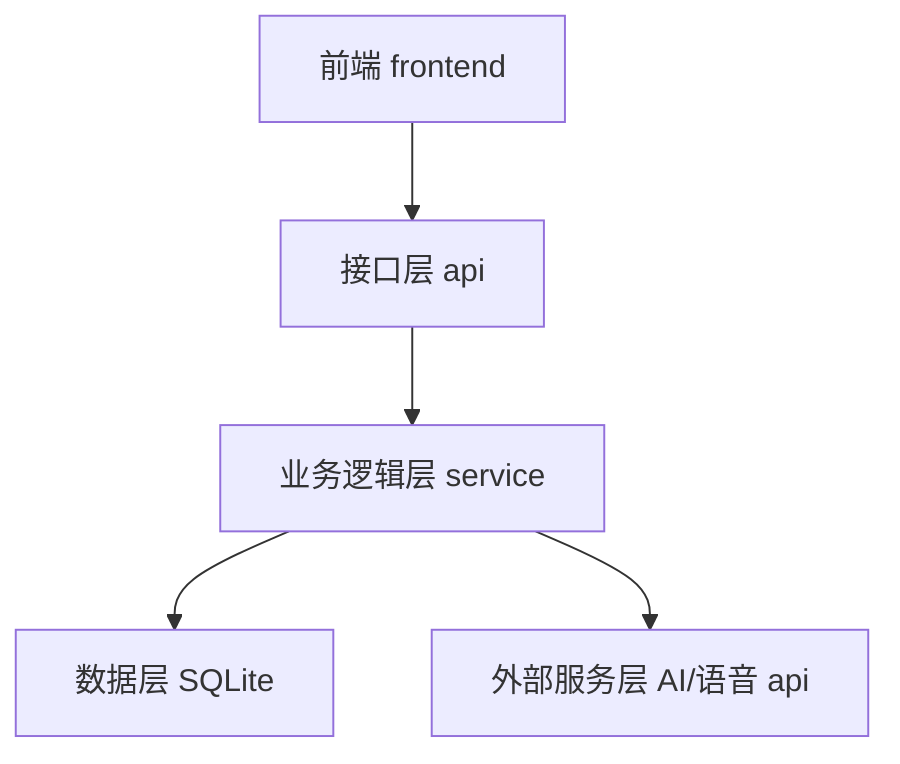
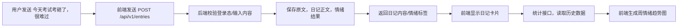

# InnerGarden

课程团队协作仓库。

## 项目流程图

### 具体示例


## 项目结构


```text
teamwork/
├── frontend/      # 前端项目
├── backend/       # 后端项目
├── data/          # 数据库初始化、种子数据和样例数据
├── docs/          # 需求、设计、报告和 vibe logs
├── tests/         # API、前端和验收测试
├── defense/       # 答辩材料、演示脚本和截图
├── scripts/       # 项目启动、安装和数据库重置脚本
└── .github/       # Issue、PR 和 CI 配置
```

## 🚀 快速开始

### 一键启动（推荐）

```batch
# Windows
scripts\start.bat

# Linux / macOS
./scripts/start.sh
```

**脚本特性：**
- 🔍 自动检测环境
- 📦 首次运行自动安装依赖
- ⚙️ 自动创建 `.env` 配置
- 🚀 并行启动前后端服务

### 停止服务

```powershell
# Windows PowerShell
powershell -ExecutionPolicy Bypass -File scripts\stop.ps1

# Linux / macOS
./scripts/stop.sh
```

或直接关闭服务窗口。

### 访问地址

启动后访问：

- 📡 **后端 API**: http://localhost:8000
- 📄 **API 文档**: http://localhost:8000/docs
- 🌐 **前端界面**: http://localhost:5173

Linux / macOS 的 `scripts/start.sh` 默认会监听 `0.0.0.0`，同一局域网设备可使用脚本输出的 `http://<本机局域网IP>:5173` 访问前端，或用 `http://<本机局域网IP>:8000/docs` 查看 API 文档。

### 手动启动（高级用户）

如果需要单独启动某个服务：

```bash
# 后端
cd backend
python -m venv venv
source venv/bin/activate  # Windows: venv\Scripts\activate
pip install -r requirements.txt
cp .env.example .env      # 配置你的 API 密钥
uvicorn app.main:app --reload

# 前端（新终端）
cd frontend
npm install
npm run dev
```

---

## CampusProject 提交流程

本仓库使用 `main` 作为稳定主分支。产品、前端、后端的工作都应先在各自任务分支完成，再通过提交记录或 Pull Request 合并到 `main`。不要直接把多个无关改动混在一次提交里。

### 1. 分工说明

#### 产品

产品负责说明“要做什么、为什么做、做到什么程度算完成”。

- 需求说明、用户故事、验收标准、演示脚本放在：
  - `docs/requirements/`
  - `docs/design/`
  - `docs/vibe-logs/`
  - `defense/`
- 在前端或后端开始实现前，需要先明确：
  - 目标用户是谁
  - 需要哪些页面或接口
  - 输入和输出规则是什么
  - 功能完成标准是什么
  - 最终展示或答辩怎么演示

#### 前端

前端负责实现用户看到和操作的页面。

- 前端代码放在 `frontend/`。
- 页面实现要对应产品需求，不单独凭感觉改交互。
- 提交前端内容时，需要说明：
  - 改了哪些页面或组件
  - 如何本地运行或预览
  - 页面变化最好附截图或演示说明
  - 依赖了哪些后端 API

#### 后端

后端负责实现 API、数据处理和服务逻辑。

- 后端代码放在 `backend/`。
- 数据库结构和种子数据放在 `data/`。
- 提交后端内容时，需要说明：
  - 新增或修改了哪些接口
  - 请求参数和响应格式是什么
  - 是否修改了 `data/init.sql` 或 `data/seed.sql`
  - 如何测试接口是否可用

### 2. 分支命名方式

每个任务单独创建分支：

```bash
git checkout main
git pull origin main
git checkout -b product/requirements-login
git checkout -b frontend/login-page
git checkout -b backend/login-api
```

推荐前缀：

- `product/`：需求、产品文档、演示脚本、产品决策
- `frontend/`：页面、组件、前端交互逻辑
- `backend/`：接口、数据库、服务端逻辑
- `docs/`：技术文档、测试文档、答辩材料
- `fix/`：问题修复

### 3. 本地开发流程

开始工作前，先同步主分支：

```bash
git checkout main
git pull origin main
```

创建任务分支：

```bash
git checkout -b frontend/example-task
```

完成修改后，先查看改动：

```bash
git status
git diff
```

只添加本次任务相关文件：

```bash
git add <changed-files>
```

提交：

```bash
git commit -m "简短说明本次修改"
```

提交信息要具体，例如：

- `Add product requirements for course search`
- `Implement frontend course list page`
- `Add backend course API`
- `Document API testing process`

### 4. 推送和合并方式

推送自己的任务分支：

```bash
git push origin <branch-name>
```

如果使用 GitHub Pull Request，目标分支选择 `main`。PR 描述需要写清楚：

- 改了什么
- 为什么改
- 如何测试
- 如果是前端，附页面截图或演示说明
- 如果是后端，附接口路径、请求示例、响应示例
- 对应的产品需求或任务说明

如果不使用 PR，由负责人本地合并到 `main` 后推送：

```bash
git checkout main
git pull origin main
git merge <branch-name>
git push origin main
```

### 5. 产品、前端、后端对接流程

建议按下面顺序协作：

1. 产品先提交需求文档，说明功能目标、页面要求、接口需求和验收标准。
2. 前端根据产品文档搭建页面结构，标记需要后端提供的数据。
3. 后端根据产品和前端需求实现 API，并在文档中写清请求和响应格式。
4. 前端接入后端 API，完成页面联调。
5. 三方一起检查验收标准，确认功能是否达到产品要求。
6. 通过测试后合并到 `main`。

### 6. 合并前检查规则

合并到 `main` 前，需要检查：

- 产品：需求是否清楚，验收标准是否可测试。
- 前端：页面是否符合需求，是否能本地运行或预览。
- 后端：接口和数据库改动是否有说明，是否测试通过。
- 联调：前端和后端的接口路径、字段名、错误处理是否一致。
- 文档：如果功能或运行方式变化，README、API 文档或测试文档是否同步更新。

### 7. 提交前检查清单

提交前请确认：

- 文件放在正确目录。
- `git status` 只包含本次任务相关文件。
- 分支基于最新 `main`。
- 提交信息清楚。
- PR 或提交说明写明了产品、前端或后端影响。
- 需要截图、接口示例、测试步骤时已经补充。
- 数据库变化已经同步到 `data/init.sql` 或 `data/seed.sql`。
