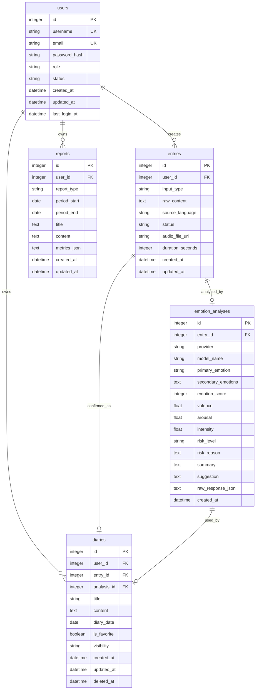

# Database Design

本文档根据 `docs/design/api-design.md` 设计 Inner Garden 第一版数据库结构。数据库设计目标是支撑登录鉴权、原始输入保存、AI 情绪分析、确认后的日记、统计图表、周期报告和管理员后台。

## 实现状态

**已实现**：
- users, entries, emotion_analyses, diaries 表
- conversations, messages, message_sources 表 (RAG Chat)

**规划中，尚未实现**：
- reports 表 (周期报告功能) - 文档中保留设计，但表尚未创建

第一版开发与课程演示阶段使用 SQLite，后端必须通过 SQLAlchemy 2 访问数据库，并通过 Alembic 管理结构变更。字段命名统一使用 snake_case，时间字段统一保存 UTC 时间，接口返回时再转换为带时区的 ISO 8601 字符串。

## 1. 设计原则

- 数据库只保存结构化、可追踪、可统计的数据，不保存前端临时状态。
- AI 输出必须落到固定字段和固定枚举，避免模型自由生成标签导致统计口径漂移。
- 原始输入 `entries`、AI 分析 `emotion_analyses` 和最终日记 `diaries` 分开保存，保证用户编辑日记后仍能追溯原始内容与分析结果。
- 用户数据全部按 `user_id` 隔离，普通用户只能访问自己的数据，管理员通过后端权限校验访问汇总数据。
- 第一版不引入向量数据库、复杂对话记忆表或文件对象存储表，避免超出课程主闭环。

## 2. 核心实体关系



## 3. 枚举约束

后端 Pydantic Schema、SQLAlchemy Model 和数据库约束应保持同一套枚举。

| 字段 | 允许值 | 说明 |
| --- | --- | --- |
| `users.role` | `user`, `admin` | 角色只区分普通用户和管理员 |
| `users.status` | `active`, `disabled` | 禁用用户不能登录 |
| `entries.input_type` | `text`, `voice` | 文字输入或语音输入 |
| `entries.status` | `pending`, `analyzed`, `failed`, `confirmed` | 原始输入处理状态 |
| `emotion_analyses.primary_emotion` | `joy`, `sadness`, `anger`, `fear`, `anxiety`, `calm`, `neutral`, `surprise`, `tired`, `confused` | 第一版固定情绪标签 |
| `emotion_analyses.risk_level` | `low`, `medium`, `high` | 风险等级固定为三档 |
| `diaries.visibility` | `private` | 第一版默认私密，预留扩展但不做分享 |
| `reports.report_type` | `daily`, `weekly`, `monthly` | 报告周期类型 |

`secondary_emotions` 在 SQLite 中保存为 JSON 字符串，在 SQLAlchemy 中用 `JSON` 类型抽象；迁移到 PostgreSQL 时可直接映射为 `JSONB`。

## 4. 表结构设计

### 4.1 users

保存账号、密码哈希、角色和状态。

| 字段 | 类型 | 约束 | 说明 |
| --- | --- | --- | --- |
| `id` | Integer | PK, autoincrement | 用户 ID |
| `username` | String(50) | NOT NULL, UNIQUE | 登录名或展示名 |
| `email` | String(255) | NOT NULL, UNIQUE | 登录邮箱 |
| `password_hash` | String(255) | NOT NULL | bcrypt 哈希后的密码 |
| `role` | String(20) | NOT NULL, default `user` | 用户角色 |
| `status` | String(20) | NOT NULL, default `active` | 用户状态 |
| `created_at` | DateTime | NOT NULL | 创建时间 |
| `updated_at` | DateTime | NOT NULL | 更新时间 |
| `last_login_at` | DateTime | NULL | 最近登录时间 |

约束与索引：

- `UNIQUE(username)`
- `UNIQUE(email)`
- `CHECK(role IN ('user', 'admin'))`
- `CHECK(status IN ('active', 'disabled'))`
- `INDEX idx_users_role_status(role, status)`

### 4.2 entries

保存用户提交的原始输入。无论 AI 是否成功，都先保存原文，便于重试和排错。

| 字段 | 类型 | 约束 | 说明 |
| --- | --- | --- | --- |
| `id` | Integer | PK, autoincrement | 原始输入 ID |
| `user_id` | Integer | NOT NULL, FK -> users.id | 所属用户 |
| `input_type` | String(20) | NOT NULL | `text` 或 `voice` |
| `raw_content` | Text | NOT NULL | 原始文字或语音转写文本 |
| `source_language` | String(20) | NOT NULL, default `zh-CN` | 输入语言 |
| `status` | String(20) | NOT NULL, default `pending` | 处理状态 |
| `audio_file_url` | String(500) | NULL | 语音文件路径或 URL，第一版可为空 |
| `duration_seconds` | Integer | NULL | 语音时长 |
| `created_at` | DateTime | NOT NULL | 创建时间 |
| `updated_at` | DateTime | NOT NULL | 更新时间 |

约束与索引：

- `FOREIGN KEY(user_id) REFERENCES users(id) ON DELETE CASCADE`
- `CHECK(input_type IN ('text', 'voice'))`
- `CHECK(status IN ('pending', 'analyzed', 'failed', 'confirmed'))`
- `CHECK(duration_seconds IS NULL OR duration_seconds >= 0)`
- `INDEX idx_entries_user_created(user_id, created_at DESC)`
- `INDEX idx_entries_status(status)`

### 4.3 emotion_analyses

保存 AI 对原始输入的结构化分析结果。一个 Entry 第一版只保留一个当前分析结果；如果未来要保留多次重试版本，可以去掉 `entry_id` 唯一约束并增加 `version` 字段。

| 字段 | 类型 | 约束 | 说明 |
| --- | --- | --- | --- |
| `id` | Integer | PK, autoincrement | 分析 ID |
| `entry_id` | Integer | NOT NULL, UNIQUE, FK -> entries.id | 对应原始输入 |
| `provider` | String(50) | NOT NULL | AI Provider 名称 |
| `model_name` | String(100) | NOT NULL | 实际模型名 |
| `primary_emotion` | String(30) | NOT NULL | 主情绪 |
| `secondary_emotions` | JSON/Text | NOT NULL, default `[]` | 次情绪数组 |
| `emotion_score` | Integer | NOT NULL | 情绪正向程度，0 到 100，50 为中性 |
| `valence` | Float | NOT NULL | 效价，建议范围 -1 到 1 |
| `arousal` | Float | NOT NULL | 唤醒度，建议范围 0 到 1 |
| `intensity` | Float | NOT NULL | 情绪强度，建议范围 0 到 1 |
| `risk_level` | String(20) | NOT NULL | 风险等级 |
| `risk_reason` | Text | NULL | 风险原因 |
| `summary` | Text | NOT NULL | 分析摘要 |
| `suggestion` | Text | NOT NULL | 给用户的建议 |
| `raw_response_json` | JSON/Text | NULL | AI 原始结构化响应，便于调试 |
| `created_at` | DateTime | NOT NULL | 创建时间 |

约束与索引：

- `FOREIGN KEY(entry_id) REFERENCES entries(id) ON DELETE CASCADE`
- `UNIQUE(entry_id)`
- `CHECK(emotion_score BETWEEN 0 AND 100)`
- `CHECK(valence >= -1 AND valence <= 1)`
- `CHECK(arousal >= 0 AND arousal <= 1)`
- `CHECK(intensity >= 0 AND intensity <= 1)`
- `CHECK(primary_emotion IN ('joy', 'sadness', 'anger', 'fear', 'anxiety', 'calm', 'neutral', 'surprise', 'tired', 'confused'))`
- `CHECK(risk_level IN ('low', 'medium', 'high'))`
- `INDEX idx_analyses_primary_emotion(primary_emotion)`
- `INDEX idx_analyses_risk_level(risk_level)`

### 4.4 diaries

保存用户确认或编辑后的最终日记正文，是历史页、详情页、日历和统计图的主要数据来源。

| 字段 | 类型 | 约束 | 说明 |
| --- | --- | --- | --- |
| `id` | Integer | PK, autoincrement | 日记 ID |
| `user_id` | Integer | NOT NULL, FK -> users.id | 所属用户 |
| `entry_id` | Integer | NOT NULL, UNIQUE, FK -> entries.id | 来源输入 |
| `analysis_id` | Integer | NOT NULL, UNIQUE, FK -> emotion_analyses.id | 使用的分析结果 |
| `title` | String(120) | NOT NULL | 日记标题 |
| `content` | Text | NOT NULL | 日记正文 |
| `diary_date` | Date | NOT NULL | 日记日期，用于日历和周期统计 |
| `is_favorite` | Boolean | NOT NULL, default false | 是否收藏 |
| `visibility` | String(20) | NOT NULL, default `private` | 可见性 |
| `created_at` | DateTime | NOT NULL | 创建时间 |
| `updated_at` | DateTime | NOT NULL | 更新时间 |
| `deleted_at` | DateTime | NULL | 软删除时间 |

约束与索引：

- `FOREIGN KEY(user_id) REFERENCES users(id) ON DELETE CASCADE`
- `FOREIGN KEY(entry_id) REFERENCES entries(id) ON DELETE RESTRICT`
- `FOREIGN KEY(analysis_id) REFERENCES emotion_analyses(id) ON DELETE RESTRICT`
- `UNIQUE(entry_id)`
- `UNIQUE(analysis_id)`
- `CHECK(visibility IN ('private'))`
- `INDEX idx_diaries_user_date(user_id, diary_date DESC)`
- `INDEX idx_diaries_user_created(user_id, created_at DESC)`
- `INDEX idx_diaries_user_favorite(user_id, is_favorite)`
- 常规查询应默认过滤 `deleted_at IS NULL`

### 4.5 reports

保存日报、周报和月报。报告可以由历史日记与情绪分析聚合生成，也可以在用户点击生成时异步写入。

| 字段 | 类型 | 约束 | 说明 |
| --- | --- | --- | --- |
| `id` | Integer | PK, autoincrement | 报告 ID |
| `user_id` | Integer | NOT NULL, FK -> users.id | 所属用户 |
| `report_type` | String(20) | NOT NULL | `daily`、`weekly` 或 `monthly` |
| `period_start` | Date | NOT NULL | 统计开始日期 |
| `period_end` | Date | NOT NULL | 统计结束日期 |
| `title` | String(160) | NOT NULL | 报告标题 |
| `content` | Text | NOT NULL | AI 生成的报告正文 |
| `metrics_json` | JSON/Text | NOT NULL | 情绪均值、分布、日记数等结构化指标 |
| `created_at` | DateTime | NOT NULL | 创建时间 |
| `updated_at` | DateTime | NOT NULL | 更新时间 |

约束与索引：

- `FOREIGN KEY(user_id) REFERENCES users(id) ON DELETE CASCADE`
- `CHECK(report_type IN ('daily', 'weekly', 'monthly'))`
- `CHECK(period_start <= period_end)`
- `UNIQUE(user_id, report_type, period_start, period_end)`
- `INDEX idx_reports_user_period(user_id, report_type, period_start DESC)`

## 5. API 与表的对应关系

| API 模块 | 主要读写表 | 说明 |
| --- | --- | --- |
| Auth 注册/登录/当前用户 | `users` | 注册写入用户，登录校验密码并更新 `last_login_at` |
| Entry 快速创建并分析 | `entries`, `emotion_analyses` | 先保存原始输入，再保存 AI 分析结构 |
| Diary 保存/列表/详情/编辑/删除 | `diaries`, `entries`, `emotion_analyses` | 保存时绑定来源输入和分析结果，删除使用软删除 |
| Stats 首页统计 | `diaries`, `emotion_analyses` | 统计日记数量、平均分、风险数量、最近情绪 |
| Emotion 趋势图 | `diaries`, `emotion_analyses` | 按 `diary_date` 聚合 `emotion_score`、`valence`、`arousal` |
| Emotion 分布图 | `emotion_analyses`, `diaries` | 按 `primary_emotion` 分组，必须过滤当前用户 |
| Reports 生成/查询 | `reports`, `diaries`, `emotion_analyses` | 周报/月报保存正文和聚合指标 |
| Admin 用户列表/统计 | `users`, `diaries`, `entries`, `emotion_analyses` | 只允许 admin 访问 |

## 6. 统计查询口径

统计接口必须使用确认后的日记作为主数据来源，即从 `diaries` 出发关联 `emotion_analyses`。这样可以避免用户只提交了 Entry 但没有确认日记时，被提前计入趋势图。

常用统计口径：

- 日记总数：`COUNT(diaries.id)`，过滤 `deleted_at IS NULL`
- 平均情绪分：`AVG(emotion_analyses.emotion_score)`
- 高风险次数：`COUNT(*) WHERE risk_level = 'high'`
- 情绪趋势：按 `diary_date` 分组，计算每日平均 `emotion_score`、`valence`、`arousal`
- 情绪分布：按 `primary_emotion` 分组，计算数量和占比
- 最近记录：按 `diaries.created_at DESC` 取最新确认日记

所有普通用户统计必须包含 `diaries.user_id = current_user.id` 条件。

## 7. 种子数据设计

`data/seed.sql` 建议至少包含以下演示数据：

- 一个管理员账号：`admin@innergarden.local`，角色为 `admin`
- 两个普通用户账号：`demo@innergarden.local`、`student@innergarden.local`
- 每个普通用户 5 到 10 条 `entries`
- 每条 Entry 对应一条 `emotion_analyses`
- 每条分析对应一条已确认 `diaries`
- 至少覆盖 `joy`、`sadness`、`anxiety`、`calm`、`neutral` 五类情绪
- 至少覆盖 `low`、`medium`、`high` 三类风险等级
- 至少生成一条 weekly report 和一条 monthly report

演示账号密码不要保存明文，`seed.sql` 中也应使用 bcrypt 后的哈希值。README 或演示脚本可以单独说明演示密码。

## 8. SQLAlchemy Model 落地建议

后端建议按表拆分模型：

```text
backend/app/models/
├── user.py
├── entry.py
├── emotion_analysis.py
├── diary.py
└── report.py
```

模型关系建议：

- `User.entries`: one-to-many
- `User.diaries`: one-to-many
- `User.reports`: one-to-many
- `Entry.analysis`: one-to-one
- `Entry.diary`: one-to-one
- `EmotionAnalysis.diary`: one-to-one

SQLite 外键需要在连接时开启：

```sql
PRAGMA foreign_keys = ON;
```

SQLAlchemy 中建议统一使用 `created_at`、`updated_at` mixin，并在 repository 层处理软删除过滤，避免每个接口重复写条件。

## 9. 迁移与兼容性

第一版可以用 `data/init.sql` 初始化数据库，但正式开发时应以 Alembic migration 作为结构变更来源。

从 SQLite 迁移到 PostgreSQL 时需要注意：

- JSON/Text 字段可改为 `JSONB`
- Boolean 在 SQLite 中实际以整数保存，PostgreSQL 中使用原生 Boolean
- SQLite 对部分 `ALTER TABLE` 支持有限，复杂变更应通过 Alembic batch migration
- 时间字段继续使用 UTC，避免本地时区和部署时区不一致

## 10. 第一版不建表的内容

以下内容第一版暂不建表：

- 会话黑名单或 refresh token 表：课程演示阶段可只使用短期 access token。
- 聊天对话表：日记对话属于第三优先级，不阻塞主闭环。
- 文件上传表：语音文件第一版可使用 `entries.audio_file_url` 简单记录。
- 图片生成历史表：封面图和分享卡片属于加分项。
- 系统配置表：固定配置放在后端配置文件或环境变量中。

## 11. 完成标准

数据库设计完成后，后端实现应满足：

- 所有核心 API 都能映射到明确的数据表。
- 注册、登录、创建 Entry、AI 分析、确认 Diary、查询历史和统计图形成闭环。
- 普通用户数据通过 `user_id` 隔离。
- 管理员接口可以查询用户数量、日记数量、情绪分布和风险分布。
- 情绪、风险、报告类型等字段使用固定枚举。
- `data/init.sql`、SQLAlchemy models 和 Alembic migration 的表结构保持一致。
