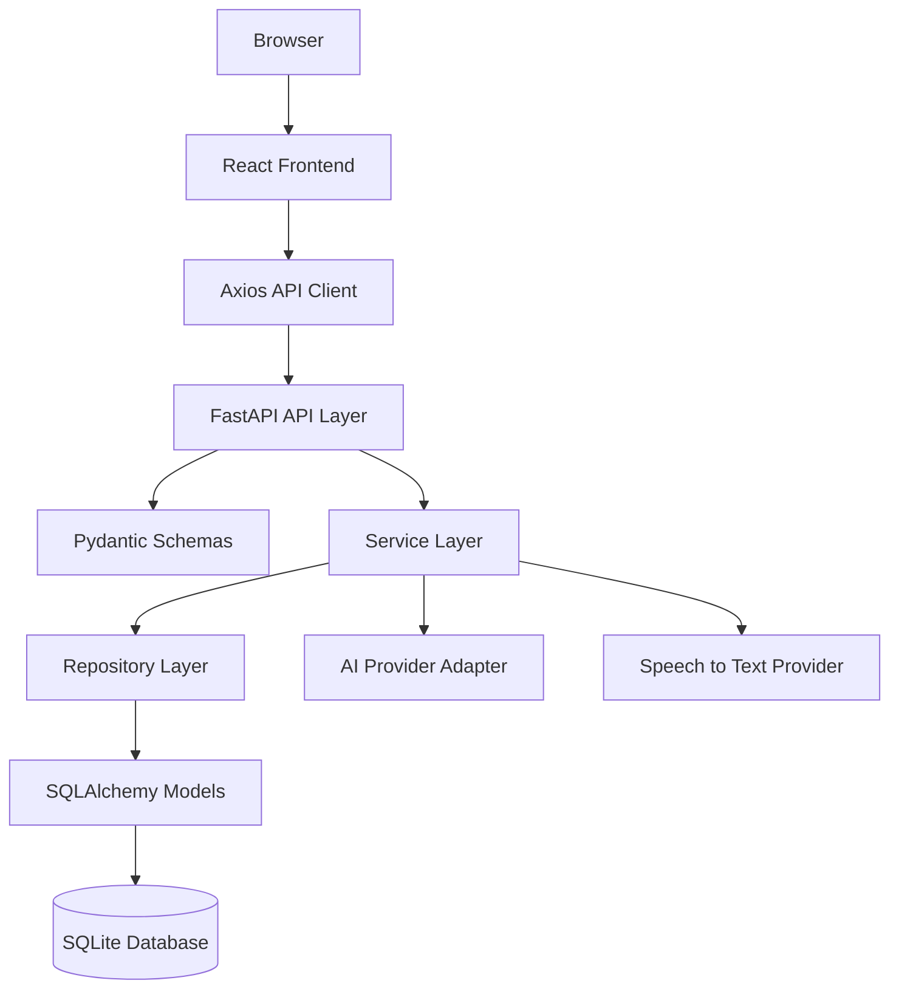

# System Architecture

本文档是 Inner Garden 的系统架构定稿。AI coding、人工开发、接口联调和数据库实现前都必须先阅读本文，并同时对齐：

- `docs/design/technology-stack.md`
- `docs/design/api-design.md`
- `docs/design/database-design.md`

任何实现如果与这三份文档冲突，应先修改设计文档并说明原因，再改代码。不要在实现过程中临时替换技术栈、临时新增接口风格或临时重设计数据库。

## 1. 架构目标

Inner Garden 是一个前后端分离的 AI 情绪日记应用。系统核心闭环是：

1. 用户登录。
2. 用户输入文字或上传语音。
3. 后端保存原始输入。
4. 后端调用 AI Provider 层生成结构化情绪分析和日记草稿。
5. 用户确认或编辑日记。
6. 后端保存最终日记。
7. 用户查看历史、趋势图、情绪分布、周报或月报。
8. 管理员查看用户与系统统计。

架构优先级是稳定、清晰、容易联调和满足课程验收，不追求复杂工程化。第一版不引入微服务、消息队列、Redis、向量数据库、WebSocket、LangGraph、复杂 Agent 或多容器部署。

## 2. 总体分层



分层职责必须固定：

- Frontend：页面、表单、路由、状态、图表渲染。
- API Client：封装 HTTP 请求、JWT 注入、错误处理。
- FastAPI Routers：接收请求、鉴权、参数校验、返回 JSON。
- Pydantic Schemas：定义请求和响应结构。
- Services：业务编排、AI 调用、统计逻辑、权限相关业务判断。
- Repositories：数据库读写，不写业务决策。
- SQLAlchemy Models：数据库表结构映射。
- AI Provider：统一封装模型供应商，业务代码不得直接依赖某一家模型 SDK。
- SQLite：第一版唯一数据库，通过 SQLAlchemy 访问。

## 3. 前端架构

前端固定使用 React、TypeScript、Vite、React Router、Axios、Zustand、Ant Design 和 ECharts。

推荐目录：

```text
frontend/src/
├── api/
│   ├── client.ts
│   ├── auth.ts
│   ├── entries.ts
│   ├── diaries.ts
│   ├── stats.ts
│   ├── reports.ts
│   └── admin.ts
├── components/
├── hooks/
├── pages/
├── routes/
├── stores/
├── types/
└── utils/
```

前端约束：

- 所有后端请求必须经过 `src/api/`，页面组件不能直接散写 `fetch` 或 `axios`。
- API base URL 统一指向 `/api/v1` 或环境变量中的后端地址。
- 请求字段、响应字段全部使用 snake_case，不在前端自行改成 camelCase 后再传回后端。
- 图表使用 ECharts，数据来自后端统计接口，前端只负责渲染。
- UI 组件使用 Ant Design，不混用 Material UI、Bootstrap、Tailwind UI 或其他组件体系。
- 页面状态可以用 React 本地状态，跨页面用户信息和 token 使用 Zustand。
- 不在前端实现核心业务计算，例如情绪分数、风险等级、周期报告生成。

## 4. 后端架构

后端固定使用 Python 3.11+、FastAPI、Pydantic、SQLAlchemy 2、Alembic、Uvicorn、JWT 和 bcrypt。

推荐目录：

```text
backend/app/
├── main.py
├── config.py
├── database.py
├── api/
│   └── v1/
│       ├── auth.py
│       ├── entries.py
│       ├── diaries.py
│       ├── stats.py
│       ├── reports.py
│       └── admin.py
├── core/
│   ├── security.py
│   └── dependencies.py
├── models/
├── repositories/
├── schemas/
├── services/
└── providers/
    ├── ai.py
    └── speech.py
```

后端约束：

- 所有接口基础路径统一为 `/api/v1`。
- 所有接口返回 JSON。
- 所有请求和响应 Schema 必须通过 Pydantic 定义。
- 所有数据库访问必须通过 SQLAlchemy，不允许在业务代码里拼接裸 SQL。
- 数据读写集中在 repositories，业务编排集中在 services。
- 鉴权和角色判断在后端完成，不能只依赖前端隐藏入口。
- 密码只保存 bcrypt hash，不保存明文。
- token 使用 JWT，认证头固定为 `Authorization: Bearer <access_token>`。
- OpenAPI 文档由 FastAPI `/docs` 自动生成，不额外维护一套冲突文档。

## 5. 数据层架构

第一版数据库固定为 SQLite。数据库设计以 `docs/design/database-design.md` 为准，核心表固定为：

- `users`
- `entries`
- `emotion_analyses`
- `diaries`
- `reports`

数据层约束：

- 不新增核心表，除非先更新 `database-design.md` 并说明原因。
- 不删除或重命名核心字段，除非同步修改 API、Schema、Model、migration 和 seed data。
- 情绪标签、风险等级、报告类型、用户状态等必须使用固定枚举。
- 统计接口必须以确认后的 `diaries` 为主数据来源，再关联 `emotion_analyses`。
- 普通用户数据必须始终带 `user_id` 过滤。
- `data/init.sql`、SQLAlchemy models 和 Alembic migration 必须保持一致。
- SQLite 外键必须开启 `PRAGMA foreign_keys = ON;`。

## 6. AI 模块架构

AI 能力只允许通过统一 Provider 层调用。业务 service 调用稳定函数，不直接拼接模型请求。

推荐入口：

- `analyze_entry(raw_content, input_type)`
- `generate_diary(raw_content, analysis)`
- `generate_report(user_id, period_start, period_end, report_type)`
- `generate_image_prompt(diary, analysis)`

AI 输出必须是结构化 JSON，并符合 `api-design.md` 中固定字段：

- `title`
- `diary_content`
- `primary_emotion`
- `secondary_emotions`
- `valence`
- `arousal`
- `emotion_score`
- `intensity`
- `summary`
- `suggestion`
- `risk_level`
- `risk_reason`

AI 约束：

- `emotion_score` 表示情绪正向程度，范围 0 到 100，50 为中性。
- `risk_level` 只能是 `low`、`medium`、`high`。
- AI 不允许自由创造情绪标签。
- AI 原始响应可以保存到 `emotion_analyses.raw_response_json`，但前端展示使用清洗后的结构化字段。
- AI 调用失败时，Entry 状态应标记为 `failed`，并返回可读错误，不应丢失原始输入。

## 7. API 边界

接口设计以 `docs/design/api-design.md` 为准。第一阶段必须优先完成：

- Health check
- Auth 注册、登录、当前用户
- Entry 快速创建并分析
- Diary 创建、列表、详情、更新、删除
- Stats 首页统计、情绪趋势、情绪分布
- Admin 用户列表和基础统计

API 约束：

- 基础路径：`/api/v1`
- 字段命名：snake_case
- 时间格式：ISO 8601
- 分页参数：`page`、`page_size`
- 成功响应：`success`、`data`、`message`、`request_id`
- 错误响应：`success`、`error.code`、`error.message`、`error.details`、`request_id`
- 认证头：`Authorization: Bearer <access_token>`

禁止同一类资源出现多套命名，例如不要同时存在 `/diary`、`/diaries`、`/journal` 三种路径。资源路径按复数名统一。

## 8. 运行与部署形态

第一版采用本地双服务运行：

```text
frontend: http://localhost:5173
backend:  http://localhost:8000
api:      http://localhost:8000/api/v1
docs:     http://localhost:8000/docs
```

开发脚本以 `scripts/` 下现有脚本为准：

- `scripts/setup.sh`
- `scripts/start-backend.sh`
- `scripts/start-frontend.sh`
- `scripts/reset-database.sh`

第一版不要求 Docker Compose、多环境 Kubernetes、Nginx 网关或云数据库。需要部署演示时，可以先使用单机前后端部署方式。

## 9. 测试策略

后端优先测试：

- 注册和登录
- 当前用户鉴权
- 普通用户不能访问他人数据
- Entry 创建后能生成 Analysis
- Diary 保存后能被历史和统计接口读取
- Stats 趋势和分布统计口径正确
- Admin 权限校验

前端优先测试：

- 登录态保存和退出
- API 401 处理
- 日记创建闭环
- 历史列表渲染
- 图表数据渲染

第一版测试工具固定：

- 后端：Pytest、FastAPI TestClient
- 前端：Vitest、ESLint、Prettier

## 10. AI Coding 开工检查清单

每次 AI coding 开始前，先确认：

- 已阅读 `technology-stack.md`，没有引入未批准技术。
- 已阅读 `api-design.md`，接口路径、字段命名和响应格式一致。
- 已阅读 `database-design.md`，表、字段、枚举和关系没有临时重设计。
- 当前任务属于第一、第二还是第三优先级。
- 如果要改数据库，已经同步考虑 `data/init.sql`、Alembic、models、schemas、seed data。
- 如果要改接口，已经同步考虑前端 `src/api/`、Pydantic Schema 和测试。
- 如果要改 AI 输出，已经同步考虑固定 JSON Schema 和入库字段。

## 11. 明确禁止

为了避免技术栈误用、接口混乱和数据库反复变化，第一版明确禁止：

- 把前端改成 Vue、Next.js、Nuxt、Svelte 或原生多页面应用。
- 把 UI 体系改成 Material UI、Bootstrap、Tailwind UI 或自造组件库。
- 把后端改成 Flask、Django、Node.js、Express、NestJS、Spring Boot 或 Go。
- 绕过 SQLAlchemy 直接在 service 或 router 中拼裸 SQL。
- 临时把数据库改成 MongoDB、Redis、PostgreSQL 专用写法或向量数据库。
- 让前端直接调用 AI 模型供应商接口。
- 在页面组件中散写 API URL。
- 新增一套与 `/api/v1` 并行的接口风格。
- 让 AI 自由生成情绪标签、风险等级或数据库字段。
- 为了单个页面方便而修改核心表结构。

## 12. 变更流程

如果确实需要改变技术栈、接口或数据库：

1. 先更新对应设计文档。
2. 写清楚为什么原设计无法满足需求。
3. 同步列出影响范围，包括前端、后端、数据库、测试和演示数据。
4. 再开始改代码。

未经文档确认的实现变更视为无效设计，不应继续扩散。
